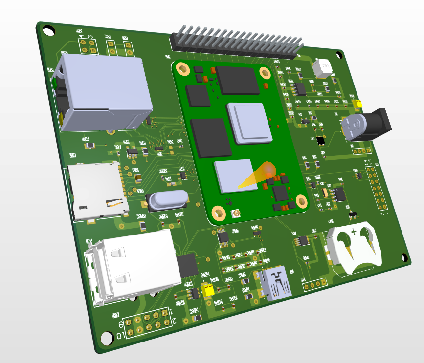

# 🖥️ Raspberry Pi 4 Custom PCB Project

This repository contains the hardware design and manufacturing files for a **custom Raspberry Pi 4 PCB project**.  
The repo is organized to make it easy for both designers and manufacturers to navigate.

---

## 📂 Repository Structure

- **DesignFiles/**  
  Original design files (schematic and PCB layout).

- **Manufacturing/**  
  Files prepared for PCB fabrication and assembly:  
  - **Gerber/** → Gerber layers + drill files  
  - **PickAndPlace/** → Pick-and-place files for automated assembly  
  - **BOM/** → Bill of Materials (BOM) for sourcing components  

- **Images/**  
  Renders and screenshots of the PCB.

---

## 🛠️ Tools Used
- **Altium** for schematic & PCB design  
- Fabrication outputs generated in **Gerber RS-274X** format  

---

## 🚀 How to Use
1. Open the schematic/PCB files in Altium.  
2. Send the **Manufacturing/Gerber** folder to your PCB fabricator.  
3. Provide the **BOM** and **PickAndPlace** files to your assembly house if you want automated assembly.  

---

## 📸 PCB Preview
*(Add images in the `Images/` folder and embed them here)*

Example:  
)

---

## 📜 License
This project is open-source under the MIT License.  
Feel free to use and modify it for your own projects.
